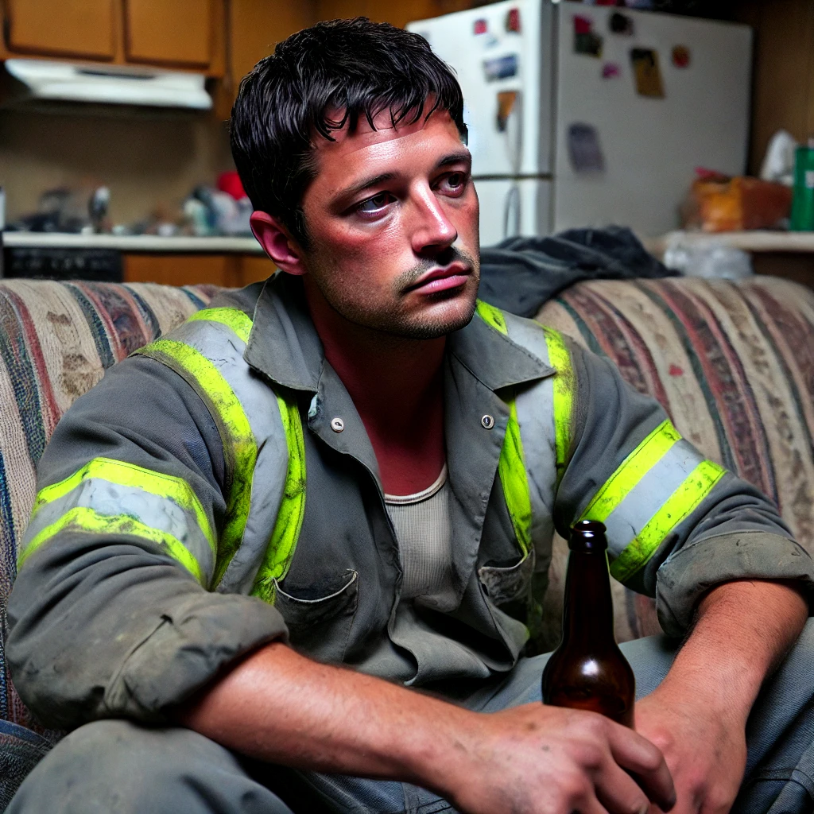

# Personas

Jason is a 23 year old college student at CSU, Chico who has trouble juggling assignment due dates and exams between the classes he’s taking.  Jason frequently has to pull late nights to finish an assignment he forgot to do, or wake up early to cram for an exam.  Jason is also a smoker who wants to quit, but the stress from his daily workload is making it difficult to find the willpower.

Goals:
	Remember to check on/complete assignments
	Start/maintain an exam study routine
	Break smoking habit

Joey Watt is a construction worker who is 25 years old and is exhausted after work. When joey gets home, he like to wind down by drinking alcohol while watching tv or online videos. Recently Joey has noticed that when he tries to relax without drinking that he is fidgety and has a harder time staying focused or going to sleep. He would like to alleviate his symptoms and get better rest by avoiding alcohol while staying away from further extraneous activities after work.

Goals: 
Stop drinking
Get better sleep
Relax

# Scenarios

Jason knows that he has 3 midterm exams coming in 3 weeks.  He also has regular assignments to complete in the meantime, so he is worried that he will miss an assignment or fall behind on his studies for the exams.  The stress from this dilemma has Jason craving a cigarette, even though he knows he’s been smoke free for 4 days.  Jason is wondering how he can keep himself accountable for maintaining his study schedule, while sticking to his goal to quit smoking.

Joey just got home after a tiring day of manual labor and sits down to ponder on what he plans to spend his night doing. Soon after he starts to tap is hands on his knees and realizes he is hungry and should cook dinner. Throughout the prep he debates whether or not he should have a drink while he cooks or even with his meal but at the same time knows that he will regret it if he does. “What can I do to keep my mind off the temptation” he thinks to himself.
