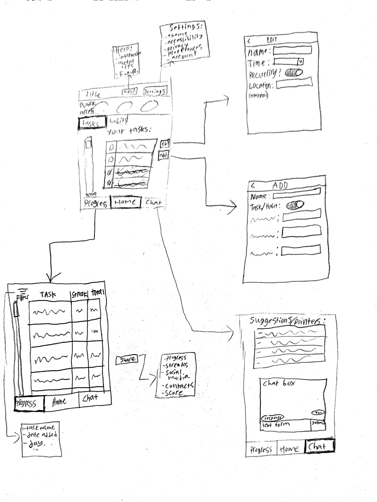

# Sketches

Homepage has a row of quick access buttons at the top for user's most important habits, a list of all tasks and habits is below that.  Progress screen shows a list of all habits, total number of times each habit was completed, and the user's current streak for that habit.  The chat screen shows a list of AI-generated suggestions for the user to help them complete their habits more often, and a chat window to get advice from an AI chatbot on how to hit their goals more consistently.