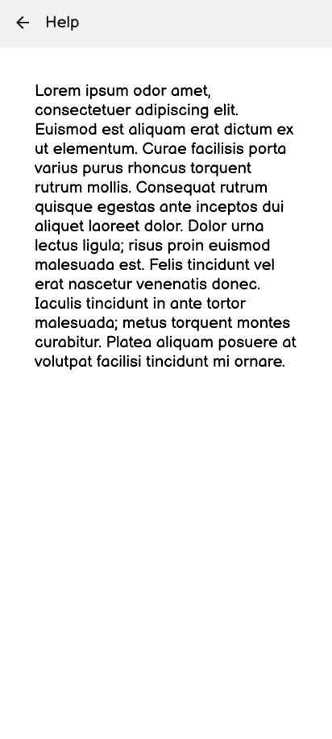
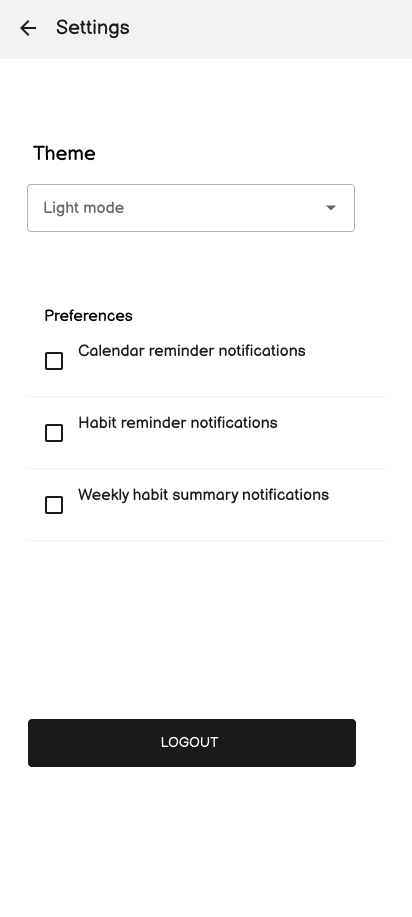
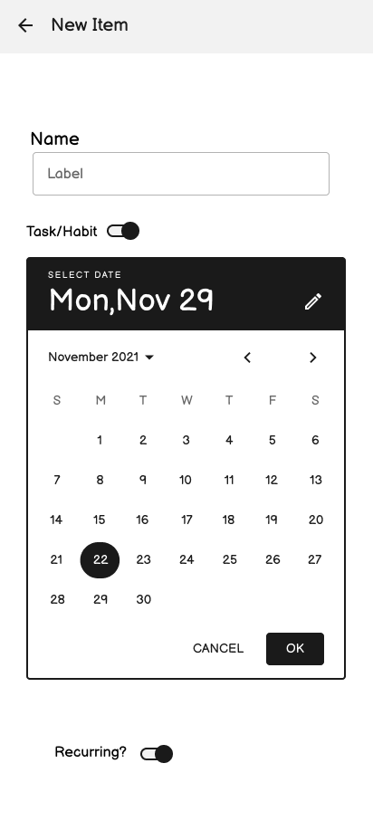
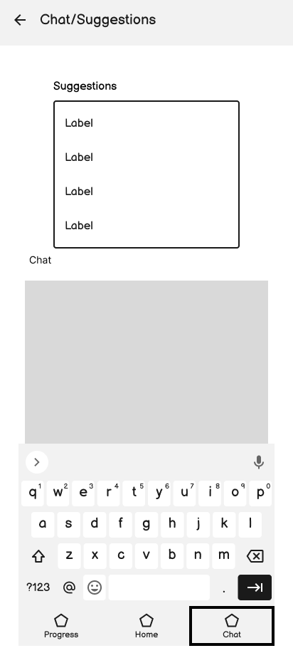
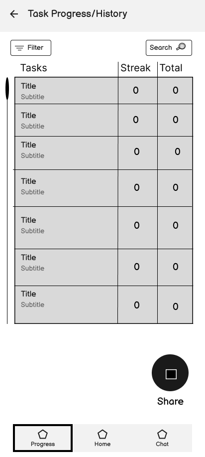
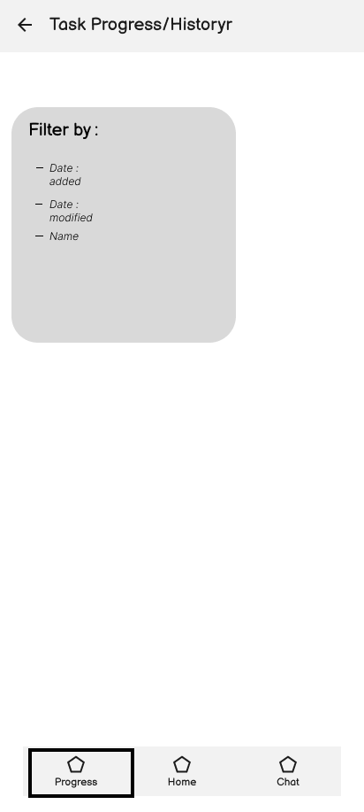

# Wireframes

When first opening the app, the user will be greeted by the login page.  Users can enter their email and password, then click login if they have used the app before, or click register to make an account and login.  After logging in, they will be taken to the home page.

HabitFlow's home page keeps tracked habits at the top of the page, for easy access when updating a habit counter, and to see habit progress at a glance.  In the middle of the page are upcoming tasks that the user has scheduled.  On the upper right are two buttons to move to the help page and the settings page respectively.  On the bottom right there is a button to start tracking a new task or habit.

The help screen contains instructions on how to create and update a habit, as well as how to track and share their progress with friends.

The settings page allows the user to select the app theme and enable or disable notifications.  Users can also logout of the app on this page.

Users can add a new habit or task on this page.  Users will choose if the new item is a habit or task, then give it a name.  Then if it is a task, the user can choose a completion date, and if the task repeats weekly.

On this screen, users can ask an AI chat for suggestions on how to hit their habit goals more consistently.

On this page, users can review their progress on their habits and tasks.  Users can choose how the items are ordered using the filter button, and they can share their progress with friends using the share button.

On this screen users can choose how they want to share their progress with friends.

On this screen users can choose how they want to sort the results on the progress page. 